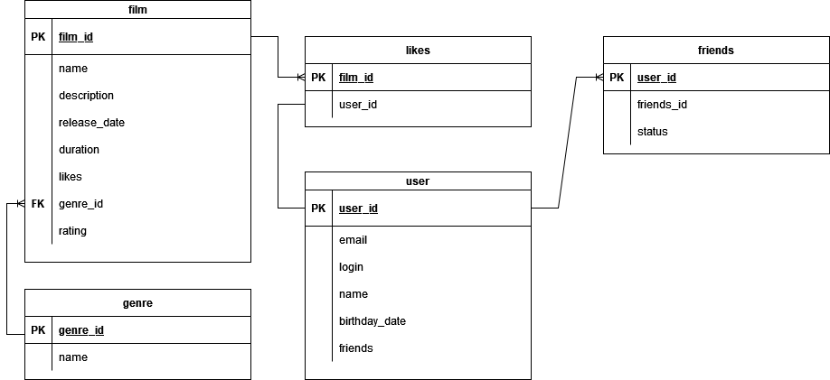

# java-filmorate

Пример запроса на получение всех фильмов: \
SELECT *\
FROM film;

Аалогично для получения всех пользователей: \
SELECT *\
FROM user;

Запрос для получения топ - n популярных фильмов:\
SELECT *\
FROM film\
ORDER BY likes DESC\
LIMIT n;

Получение списка общих друзей пользователя(id) и пользователя(otherId):
SELECT friends_id\
FROM friends\
WHERE user_id = id OR user_id = otherId\
GROUP BY friends_id\
HAVING COUNT(friends_id) > 1;

